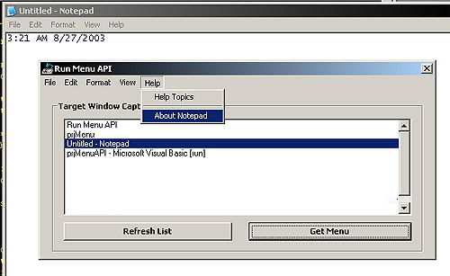



## MenuAPI Example v1

### Description

This shows how to access another process' menu and clone it in your own application using API. The example allows you to choose an app from a list of open windows, then once the menu is 'cloned', it will allow you to execute menu items in the other process by clicking on them in your own app. This also demonstrates how to create & remove dynamic menus and submenus on your form, as well as handle messages from them when clicked (uses subclassing). API Calls: IsWindow(), SetWindowLong(), EnumWindows(), GetMenuString(), GetMenuItemID(), GetMenuItemCount(), GetMenu(), GetSubMenu(), AppendMenu(), DeleteMenu(), CreatePopupMenu(), DrawMenuBar(), CallWindowProc(), PostMessage(), GetWindowTextLength(), GetWindowText(), & IsWindowVisible()
 
### More Info
 
As with any subclassing and cross-process calls, debugging can be tricky and cause VB Environment to crash so save project often if you make any changes.

             |
---                |---
**Submitted On**   |2003-08-27 03:14:00
**By**             |[Danny Krotzer](https://github.com/Planet-Source-Code/PSCIndex/blob/master/ByAuthor/danny-krotzer.md)
**Level**          |Advanced
**User Rating**    |5.0 (25 globes from 5 users)
**Compatibility**  |VB 6\.0
**Category**       |[Windows API Call/ Explanation](https://github.com/Planet-Source-Code/PSCIndex/blob/master/ByCategory/windows-api-call-explanation__1-39.md)
**World**          |[Visual Basic](https://github.com/Planet-Source-Code/PSCIndex/blob/master/ByWorld/visual-basic.md)
**Archive File**   |[MenuAPI\_Ex1636128272003\.zip](https://github.com/Planet-Source-Code/danny-krotzer-menuapi-example-v1__1-48021/archive/master.zip)

